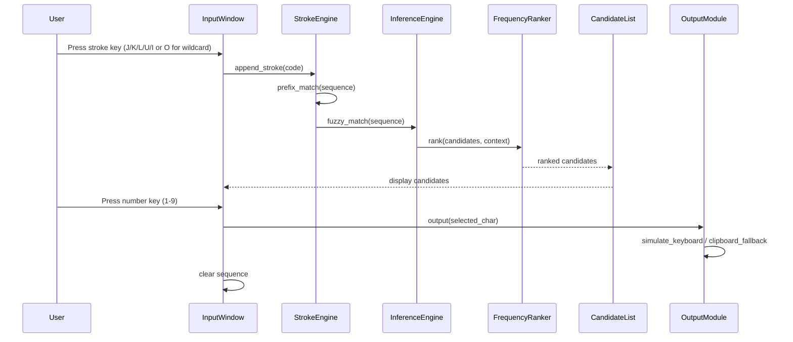

# Design Document: 筆畫輸入法 (Stroke Input Method)

## Overview

本設計描述一個基於 Python 的 Windows 筆畫輸入法工具。系統以 standalone application 形式運行（非 TSF IME），透過 system tray 常駐 + 浮動輸入視窗提供五鍵筆畫輸入體驗。

### Key Design Decisions

1. **Data Source**: Make Me a Hanzi (`dictionary.txt` + `graphics.txt`) 提供筆畫資料。`graphics.txt` 中的 SVG stroke path 需透過 stroke classifier 分類為五種基本筆畫。
2. **Architecture**: 單一 Python process，使用 PyQt6/PySide6 作為 GUI framework（支援 always-on-top、system tray、borderless window）。
3. **Stroke Classification**: SVG path data 中的 stroke type 可從 `graphics.txt` 的 `strokes` 欄位直接取得（每個 stroke 的 SVG path），需要根據 path 的幾何特徵分類為 橫(1)、豎(2)、撇(3)、點(4)、折(5)。
4. **Character Output**: 使用 `pyautogui` 或 `win32api` 模擬鍵盤輸入，clipboard fallback 使用 `pyperclip`。
5. **Database Format**: 解析後的資料序列化為 JSON（開發/debug 用）和 compact binary（msgpack，production 用）。
6. **Hotkey Registration**: 使用 `keyboard` library 或 Win32 `RegisterHotKey` API 註冊全域快捷鍵。
7. **Stroke Key Mapping（參考 macOS 筆畫輸入法）**: 採用與 macOS Stroke - Traditional 相同的鍵盤配置，使用右手主鍵區 U/I/O/J/K/L 六鍵輸入：

| 筆畫 | Stroke | 按鍵 Key | 內部代碼 Code |
|------|--------|----------|--------------|
| 一 (橫) | Horizontal | J | 1 |
| 丨 (豎) | Vertical | K | 2 |
| 丿 (撇) | Left-falling | L | 3 |
| 丶 (點) | Dot/Right-falling | U | 4 |
| 乛 (折) | Hook/Turning | I | 5 |
| ＊ (萬用) | Wildcard | O | 6 |

此配置讓使用者右手自然放置於鍵盤主區即可操作，與 macOS 內建筆畫輸入法完全一致，降低跨平台使用者的學習成本。

### Data Source Research: Make Me a Hanzi

**dictionary.txt** 格式（每行一個 JSON object）：
```json
{"character":"字","definition":"letter, character, word","pinyin":["zì"],"decomposition":"⿱宀子","radical":"子","matches":[[0,0],[0,0],[0,0],[1,1],[1,1],[1,1]]}
```
關鍵欄位：`character`、`decomposition`、`radical`、`pinyin`。

**graphics.txt** 格式（每行一個 JSON object）：
```json
{"character":"字","strokes":["M 339 ...","M 441 ...","M 255 ..."],"medians":[[[340,750],...],[[442,663],...],[[256,617],...]]}
```
關鍵欄位：`strokes`（SVG path strings）、`medians`（筆畫中線座標點）。

**Stroke Classification Strategy**: `medians` 欄位提供每個筆畫的中線座標序列，可透過分析起點/終點的相對位置和方向變化來分類：
- 橫(1): 主要水平方向（Δx 大，Δy 小）
- 豎(2): 主要垂直方向（Δy 大，Δx 小）
- 撇(3): 左下方向（Δx 負，Δy 正）
- 點(4): 短筆畫或右下方向
- 折(5): 方向有明顯轉折（多段方向變化）

## Architecture

```mermaid
graph TB
    subgraph Application["Tray Application (Main Process)"]
        TrayApp[Tray_App<br/>System Tray Manager]
        Settings[Settings Manager]
        ErrorLogger[Error_Logger<br/>Rotating File Logger]
        ResourceMonitor[Resource_Monitor]
    end

    subgraph GUI["GUI Layer (Qt)"]
        InputWindow[Input_Window<br/>Floating Borderless Window]
        CandidateList[Candidate_List<br/>Display Component]
        SettingsDialog[Settings Dialog]
    end

    subgraph Engine["Core Engine"]
        StrokeEngine[Stroke_Engine<br/>Prefix + Wildcard Matcher]
        InferenceEngine[Inference_Engine<br/>Fuzzy Match + Context]
        FrequencyRanker[Frequency_Ranker<br/>Composite Scoring]
    end

    subgraph Data["Data Layer"]
        StrokeDB[Stroke_Database<br/>Character → Stroke Mapping]
        PhraseDict[Phrase_Dictionary<br/>Word/Phrase Store]
        UserFreq[User Frequency Store]
        ConfigFile[Config File (JSON)]
    end

    subgraph Output["Output Layer"]
        OutputModule[Output_Module<br/>Keyboard Sim + Clipboard]
    end

    TrayApp --> InputWindow
    TrayApp --> Settings
    TrayApp --> ErrorLogger
    TrayApp --> ResourceMonitor
    InputWindow --> StrokeEngine
    InputWindow --> CandidateList
    StrokeEngine --> InferenceEngine
    StrokeEngine --> StrokeDB
    InferenceEngine --> FrequencyRanker
    FrequencyRanker --> UserFreq
    FrequencyRanker --> PhraseDict
    CandidateList --> OutputModule
    Settings --> ConfigFile
    Settings --> SettingsDialog
```

### Component Interaction Flow



